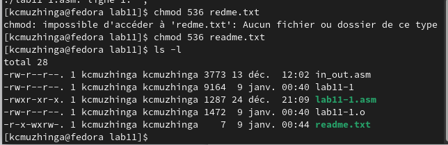

---
## Front matter
title: "Отчёта по лабораторной работе No11"
author: "Мижинга кармель чибангу"

## Generic otions
lang: ru-RU
toc-title: "Содержание"

## Bibliography
bibliography: bib/cite.bib
csl: pandoc/csl/gost-r-7-0-5-2008-numeric.csl

## Pdf output format
toc: true # Table of contents
toc-depth: 2
lof: true # List of figures
lot: true # List of tables
fontsize: 12pt
linestretch: 1.5
papersize: a4
documentclass: scrreprt
## I18n polyglossia
polyglossia-lang:
  name: russian
  options:
	- spelling=modern
	- babelshorthands=true
polyglossia-otherlangs:
  name: english
## I18n babel
babel-lang: russian
babel-otherlangs: english
## Fonts
mainfont: PT Serif
romanfont: PT Serif
sansfont: PT Sans
monofont: PT Mono
mainfontoptions: Ligatures=TeX
romanfontoptions: Ligatures=TeX
sansfontoptions: Ligatures=TeX,Scale=MatchLowercase
monofontoptions: Scale=MatchLowercase,Scale=0.9
## Biblatex
biblatex: true
biblio-style: "gost-numeric"
biblatexoptions:
  - parentracker=true
  - backend=biber
  - hyperref=auto
  - language=auto
  - autolang=other*
  - citestyle=gost-numeric
## Pandoc-crossref LaTeX customization
figureTitle: "Рис."
tableTitle: "Таблица"
listingTitle: "Листинг"
lofTitle: "Список иллюстраций"
lotTitle: "Список таблиц"
lolTitle: "Листинги"
## Misc options
indent: true
header-includes:
  - \usepackage{indentfirst}
  - \usepackage{float} # keep figures where there are in the text
  - \floatplacement{figure}{H} # keep figures where there are in the text
---
# Цель работы

Приобрестни навыки работы с файлами в языке NASM и научиться управлять правами доступа к файлам.

# Задание

1. Изучите примеры реализации подпрограмм

2. Использование программы записи сообщений в файл сообщений

4. Выполните самостоятеьное задание

3. Загрузите файлы на GitHub.

# Теоретическое введение

ОС GNU/Linux является многопользовательской операционной системой. И
для обеспечения защиты данных одного пользователя от действий других поль-
зователей существуют специальные механизмы разграничения доступа к фай-
лам. Кроме ограничения доступа, данный механизм позволяет разрешить дру-
гим пользователям доступ данным для совместной работы.
Права доступа определяют набор действий (чтение, запись, выполнение), раз-
решённых для выполнения пользователям системы над файлами. Для каждого
файла пользователь может входить в одну из трех групп: владелец, член группы
владельца, все остальные. Для каждой из этих групп может быть установлен свой
набор прав доступа. Владельцем файла является его создатель. Для предостав-
ления прав доступа другому пользователю или другой группе командой
chown [ключи] <новый_пользователь>[:новая_группа] <файл>
или
chgrp [ключи] < новая_группа > <файл>
Набор прав доступа задается тройками битов и состоит из прав на чтение,
запись и исполнение файла. В символьном представлении он имеет вид строк
rwx, где вместо любого символа может стоять дефис. Всего возможно 8 комбина-
ций, приведенных в таблице 11.1. Буква означает наличие права (установлен в
единицу второй бит триады r — чтение, первый бит w — запись, нулевой бит х —
исполнение), а дефис означает отсутствие права (нулевое значение соответству-
ющего бита). Также права доступа могут быть представлены как восьмеричное
число. Так, права доступа rw- (чтение и запись, без исполнения) понимаются
как три двоичные цифры 110 или как восьмеричная цифра 6.

# Выполнение лабораторной работы
Создадим рабочую дерикторию и файл, запишем туда код программы из листинга. (рис. [-@fig:001])

{ #fig:001 width=70% }

Проассемблируем программу и проверим ее работу(рис. [-@fig:002])

{ #fig:002 width=70% }

Запретим исполнение для файла lab11-1.(рис. [-@fig:003])

{ #fig:003 width=70% }

если запретить исполнение файла, то исполнить его станет невозможно.

Когда мы разрешим исполнение файла с расширением .asm и собственно исполним его, то мы увидем множество ошибок, ведь этот файл не предназначен для такого использования.(рис. [-@fig:004])

{ #fig:004 width=70% }

Зададим файлу readme.txt права использования как во варианте 17 и проверим как получилось.(рис. [-@fig:005])

{ #fig:005 width=70% }

# Задания для самостоятельной работы

{ #fig:006 width=70% }

{ #fig:007 width=70% }

# Выводы

В заключение мы приобрели навыки работы с файлами в NASM и разрешениями файлов.

# Список литературы{.unnumbered}

1. [Расширенный ассемблер: NASM](https://www.opennet.ru/docs/RUS/nasm/)
2. [MASM, TASM, FASM, NASM под Windows и Linux](https://habr.com/ru/post/326078/)
